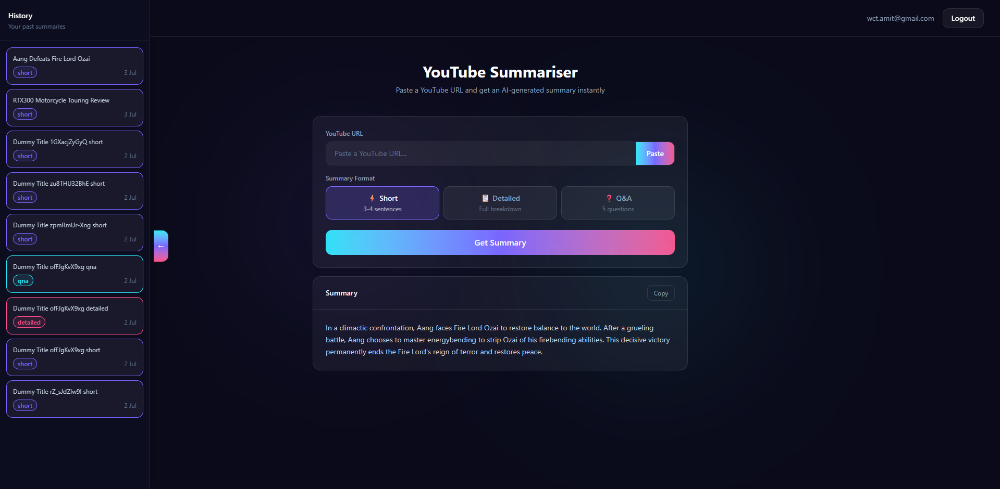

# YT Summariser

An AI-powered YouTube video summariser built with Node.js, React, PostgreSQL, and Google Gemini. Paste any YouTube URL and get a short summary, detailed breakdown, or Q&A in seconds — with smart caching so repeat requests are instant.

   

---

## Live Demo



- **Frontend:** [yt-summariser](https://yt-summariser-eta.vercel.app/)
- **Backend:** [yt-summariser](https://yt-summariser-vuqv.onrender.com)

---

## Features

- **AI Summaries** — Short, Detailed, or Q&A format powered by Google Gemini
- **Smart Caching** — Same video + format combination is cached in PostgreSQL, skipping Gemini entirely on repeat requests
- **AI-generated Titles** — Gemini generates a concise title for each summary
- **History Panel** — Slide-in panel showing all past summaries with titles, type badges, and dates
- **JWT Auth** — Secure authentication with access token + refresh token rotation
- **Clipboard Paste** — One-click paste button reads directly from clipboard
- **Markdown Rendering** — Summaries rendered with full GFM markdown support

---

## Tech Stack

### Backend

| Technology         | Purpose                                    |
| ------------------ | ------------------------------------------ |
| Node.js + Express  | REST API server                            |
| PostgreSQL         | Primary database + caching layer           |
| Docker             | Local database setup                       |
| JWT                | Authentication with refresh token rotation |
| Google Gemini API  | AI summary + title generation              |
| youtube-transcript | Fetching video transcripts                 |
| Morgan             | HTTP request logging                       |
| express-rate-limit | API rate limiting                          |

### Frontend

| Technology      | Purpose                                      |
| --------------- | -------------------------------------------- |
| React + Vite    | Frontend framework                           |
| React Query     | Server state management + cache invalidation |
| Axios           | HTTP client with interceptors                |
| React Router v6 | Client-side routing                          |
| Tailwind CSS v4 | Styling                                      |
| ReactMarkdown   | Markdown rendering                           |
| remark-gfm      | GitHub Flavored Markdown support             |

---

## Architecture

```
Client (React)
    ↓ Axios (auto token refresh interceptor)
Express API
    ↓
┌─────────────────────────────────────────┐
│  verifyToken middleware                 │
│  extractVideoId utility                 │
│  Check PostgreSQL cache                 │
│  ↓ (cache miss only)                   │
│  youtube-transcript → fetch transcript  │
│  Gemini API → generate summary + title  │
│  Save to PostgreSQL cache               │
└─────────────────────────────────────────┘
    ↓
Response to client
```

**Key design decisions:**

- Access tokens stored in memory only (not localStorage) — XSS safe
- Refresh tokens stored in PostgreSQL — fully revocable on logout
- Cache key = `video_id + summary_type` — same video, different formats cached separately
- Gemini returns JSON with `{ title, summary }` — single API call for both

---

## Getting Started

### Prerequisites

- Node.js 18+
- Docker Desktop
- Google Gemini API key (free at [aistudio.google.com](https://aistudio.google.com))

### 1. Clone the repo

```bash
git clone https://github.com/Amit-exe/yt-summariser.git
cd yt-summariser
```

### 2. Start the database

```bash
cd backend
docker-compose up -d
```

### 3. Configure backend environment

Create `backend/.env`:

```env
PORT=5000
DB_HOST=localhost
DB_PORT=5432
DB_NAME=yt_summariser
DB_USER=postgres
DB_PASSWORD=postgres
JWT_ACCESS_SECRET=your_access_secret_here
JWT_REFRESH_SECRET=your_refresh_secret_here
JWT_ACCESS_EXPIRY=15m
JWT_REFRESH_EXPIRY=7d
GEMINI_API_KEY=your_gemini_api_key_here
```

### 4. Install and run backend

```bash
cd backend
npm install
npm run dev
```

Server runs at `http://localhost:5000`

### 5. Configure frontend environment

Create `frontend/.env`:

```env
VITE_API_URL=http://localhost:5000
```

### 6. Install and run frontend

```bash
cd frontend
npm install
npm run dev
```

App runs at `http://localhost:5173`

---

## API Endpoints

### Auth

| Method | Endpoint             | Description                                |
| ------ | -------------------- | ------------------------------------------ |
| POST   | `/api/auth/register` | Register new user                          |
| POST   | `/api/auth/login`    | Login, returns access + refresh token      |
| POST   | `/api/auth/refresh`  | Rotate refresh token, get new access token |
| POST   | `/api/auth/logout`   | Invalidate refresh token                   |

### Summarise

| Method | Endpoint                 | Description                      | Auth |
| ------ | ------------------------ | -------------------------------- | ---- |
| POST   | `/api/summarise`         | Generate or fetch cached summary | ✅   |
| GET    | `/api/summarise/history` | Get user's summary history       | ✅   |

### Request body for `/api/summarise`

```json
{
  "videoUrl": "https://www.youtube.com/watch?v=VIDEO_ID",
  "summaryType": "short | detailed | qna"
}
```

### Response

```json
{
  "summary": "AI generated summary text...",
  "title": "AI generated title",
  "cached": false
}
```

---

## Project Structure

```
yt-summariser/
├── backend/
│   ├── config/
│   │   ├── db.js              # PostgreSQL connection
│   │   └── initDb.js          # Table creation on startup
│   ├── controllers/
│   │   ├── authController.js  # Register, login, logout, refresh
│   │   └── summaryController.js # Summarise + history
│   ├── middleware/
│   │   ├── AppError.js        # Custom error class
│   │   ├── authMiddleware.js  # JWT verification
│   │   └── errorHandler.js    # Global error handler
│   ├── routes/
│   │   ├── authRoute.js
│   │   └── summaryRoute.js
│   ├── services/
│   │   ├── geminiService.js   # Gemini API integration
│   │   └── youtubeService.js  # Transcript fetching
│   ├── utils/
│   │   ├── extractVideoId.js  # Parse any YouTube URL format
│   │   ├── generateTokens.js  # JWT token generation
│   │   └── limiter.js         # Rate limiter factory
│   ├── docker-compose.yml
│   ├── server.js
│   └── app.js
│
├── frontend/
│   └── src/
│       ├── api/
│       │   └── axios.js           # Axios instance + interceptors
│       ├── components/
│       │   ├── HistoryPanel.jsx   # Slide-in history drawer
│       │   ├── Navbar.jsx
│       │   ├── PasteInputBox.jsx  # Clipboard paste input
│       │   ├── ProtectedRoute.jsx
│       │   ├── SelectType.jsx     # Summary type selector
│       │   └── Summary.jsx        # Markdown summary display
│       ├── context/
│       │   └── AuthContext.jsx    # Global auth state
│       ├── hooks/
│       │   ├── useHistory.js      # React Query history fetcher
│       │   └── useSummarise.js    # Mutation + cache invalidation
│       └── pages/
│           ├── Dashboard.jsx
│           ├── Login.jsx
│           └── Register.jsx
│
└── README.md
```

---

## Key Implementation Details

### Refresh Token Rotation

Every `/auth/refresh` call deletes the old refresh token and issues a new one. Stolen refresh tokens become invalid after a single use.

### Query Optimization (Cache Layer)

Before calling Gemini, the API checks `summaries` table for `video_id + summary_type`. Cache hits return instantly — no transcript fetch, no AI call. Same video requested 100 times only ever calls Gemini once per summary type.

### Axios Interceptors

The frontend Axios instance automatically:

1. Attaches the access token to every request
2. On 401 response — silently calls `/auth/refresh`, updates tokens, retries the original request
3. On refresh failure — clears tokens and redirects to login

Users never see token expiry — it's completely transparent.

---

## Deployment

### Backend → Render

1. Push to GitHub
2. Create new Web Service on Render, connect repo, set root to `backend/`
3. Add all environment variables from `.env`
4. Create a PostgreSQL instance on Render, copy the connection string to `DATABASE_URL` env var

### Frontend → Vercel

1. Create new project on Vercel, connect repo, set root to `frontend/`
2. Add `VITE_API_URL` pointing to your Render backend URL
3. Deploy

---

## Author

**Amit Kushwaha** — Full Stack Developer, Mumbai

[LinkedIn](https://www.linkedin.com/in/amit-kushwaha-sde/) · [GitHub](https://github.com/Amit-exe) · [amit.09.sde@gmail.com](mailto:amit.09.sde@gmail.com)
